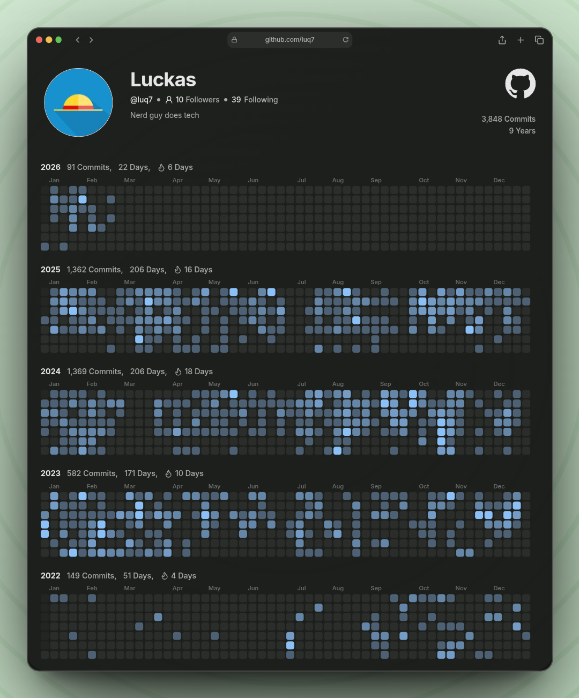

<table>
  <tr>
    <td valign="top" width="50%">
      
    </td>
    <td valign="top">

- 👋 Hi, I'm @luq7
- 👀 I'm interested in Theoretical Computer Science
- 🌱 I'm currently learning Redis and Flutter framework
- 💞️ I'm looking to collaborate on ...
- 📫 How to reach me ...

    </td>
  </tr>
</table>

<!---
luq7/luq7 is a ✨ special ✨ repository because its `README.md` (this file) appears on your GitHub profile.
You can click the Preview link to take a look at your changes.
--->
